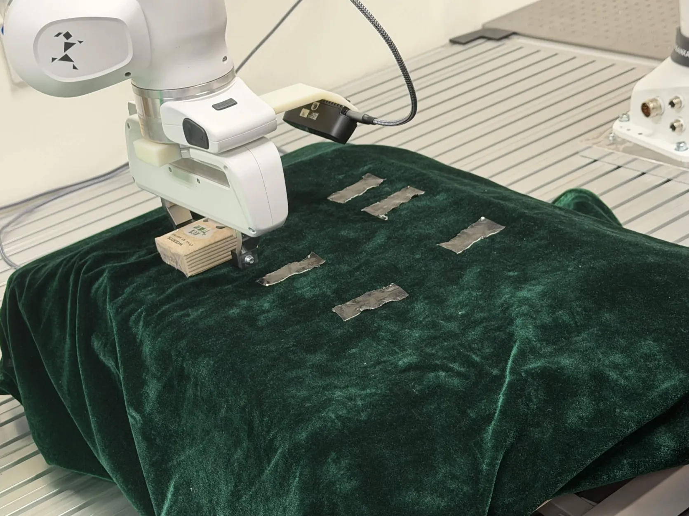

End Effector at TARGET_POSITION_M = [0.05, 0.4, 0.28] TARGET_RPY_DEG = [-180, 0, 45] is right above a desk (can't get lower than that). There is a bag of tissue right above the desk at that point aligning with the franka hand, which means that franka can easily hold the bag of tissue when grasped (with lower force)

I want a pipeline specificially to collect policy training data for the following tasks:

set initial end effector pose as POSITION = [0.05, 0.4, 0.4] RPY_DEG = [-180, 0, 45] 

the tissue bag has the following randomly sampled initial and target pose (POSITION and RPY_DEG): 

([0.05, 0.4, 0.29], [-180, 0, 45]),
([0.15, 0.4, 0.29], [-180, 0, 45]),
([0.25, 0.4, 0.29], [-180, 0, 45]),
([0.05, 0.5, 0.29], [-180, 0, 45]),
([0.15, 0.5, 0.29], [-180, 0, 45]),
([0.25, 0.5, 0.29], [-180, 0, 45]),

([0.05, 0.4, 0.29], [-180, 0, 135]),
([0.15, 0.4, 0.29], [-180, 0, 135]),
([0.25, 0.4, 0.29], [-180, 0, 135]),
([0.05, 0.5, 0.29], [-180, 0, 135]),
([0.15, 0.5, 0.29], [-180, 0, 135]),
([0.25, 0.5, 0.29], [-180, 0, 135]),

([0.05, 0.4, 0.29], [-180, 0, -45]),
([0.15, 0.4, 0.29], [-180, 0, -45]),
([0.25, 0.4, 0.29], [-180, 0, -45]),
([0.05, 0.5, 0.29], [-180, 0, -45]),
([0.15, 0.5, 0.29], [-180, 0, -45]),
([0.25, 0.5, 0.29], [-180, 0, -45]),

Please refer to /home/zhenya/kenny/visuotact/vt_franka/robot_controller/scripts/test_position.py for more details.

we define the following terms:

- lift up: move Z from 0.29 to 0.35
- lower down: move Z from 0.35 to 0.29
- clockwise 90 degree: from ([0.05, 0.4, 0.29], [-180, 0, 45]) to ([0.05, 0.4, 0.29], [-180, 0, 135])
- move to front 10cm: from ([0.05, 0.4, 0.29], [-180, 0, 45]) to ([0.05, 0.5, 0.29], [-180, 0, 45])
- move to right 10cm: from ([0.05, 0.4, 0.29], [-180, 0, 45]) to ([0.15, 0.4, 0.29], [-180, 0, 45])
Write me a script to use an expert to randomly sample n data which consists of the current data and a language instructions

Language instruction templates (can have some more variations to increase the language variety): 
"Move the tissue to the {front/back/right/left} 10 cm."
"Move the tissue to the {front/back/right/left} 10 cm and to the {front/back/right/left} 10 cm."
"Rotate the tissue {clockwise/anticlockwise} {90/180(only clockwise 180 when in -45 and anticlockwise 180 when yaw = 135)} degree."
"Move the tissue to the {front/back/right/left} 10 cm and Rotate it {clockwise/anticlockwise} {90/180} degree."

We must make sure that the inital goal and the end goal lie inside the set of:

{([0.05, 0.4, 0.29], [-180, 0, 45]),
([0.15, 0.4, 0.29], [-180, 0, 45]),
([0.25, 0.4, 0.29], [-180, 0, 45]),
([0.05, 0.5, 0.29], [-180, 0, 45]),
([0.15, 0.5, 0.29], [-180, 0, 45]),
([0.25, 0.5, 0.29], [-180, 0, 45]),

([0.05, 0.4, 0.29], [-180, 0, 135]),
([0.15, 0.4, 0.29], [-180, 0, 135]),
([0.25, 0.4, 0.29], [-180, 0, 135]),
([0.05, 0.5, 0.29], [-180, 0, 135]),
([0.15, 0.5, 0.29], [-180, 0, 135]),
([0.25, 0.5, 0.29], [-180, 0, 135]),

([0.05, 0.4, 0.29], [-180, 0, -45]),
([0.15, 0.4, 0.29], [-180, 0, -45]),
([0.25, 0.4, 0.29], [-180, 0, -45]),
([0.05, 0.5, 0.29], [-180, 0, -45]),
([0.15, 0.5, 0.29], [-180, 0, -45]),
([0.25, 0.5, 0.29], [-180, 0, -45])}

The programme of the expert:

Initialization:

Step 1. The robot arm move to initialization pose POSITION = [0.05, 0.4, 0.4] RPY_DEG = [-180, 0, 45].
Step 2. The user will then set up the scene, put the tissue at pose: ([0.05, 0.4, 0.29], [-180, 0, 45]).
Step 3. The user press Enter, the robot expert starts automatically:

While not collected n episodes yet:

robot moves to initial pose

record an episode of followings:
- expert generate an instruction, initial pose and goal pose.
- expert moves to the initial pose with z = 35 (right above the tissue)
- expert moves down to z = 0.29
- expert grasp (close gripper with weak force since it's a tissue)
- expert lift up the tissue by moving to z = 0.35
- expert moves to goal pose with z = 35
- expert release the gripper then wait for a while, end the episode

wait for user to confirm (can set to skip) to start another episode from moving to initial pose, for the next episode, initial pose is the goal pose of the previous episode.
